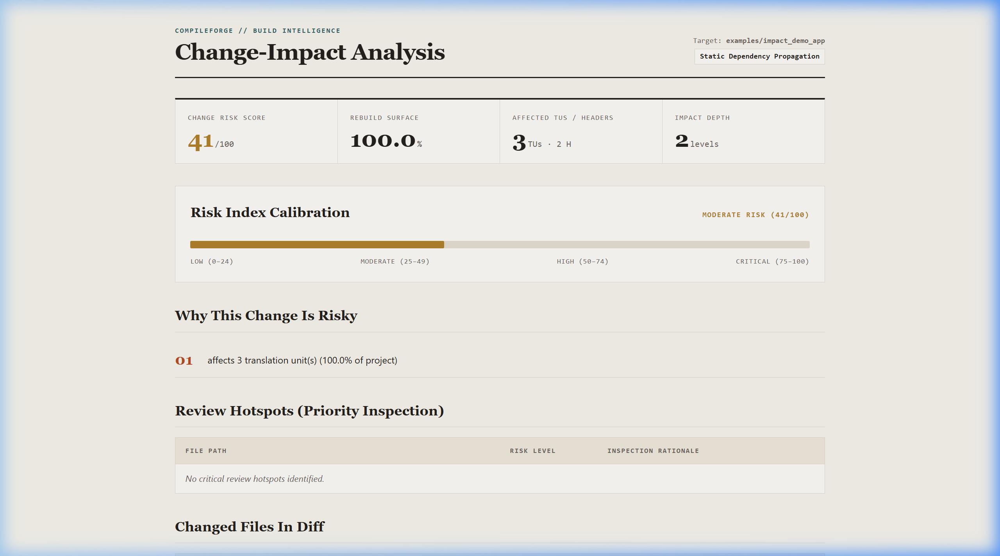
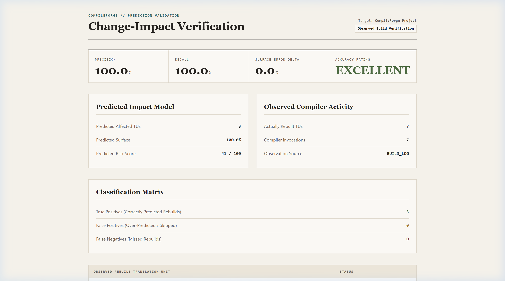
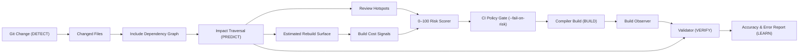
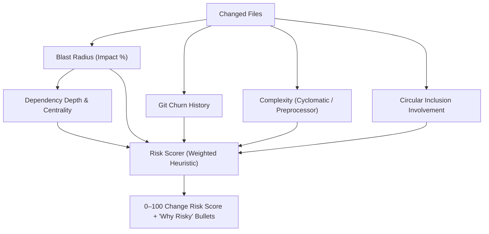

# CompileForge

## Know the likely cost of a C++ code change before you merge it.

[](https://en.cppreference.com/w/cpp/20)
[](#testing)
[](#provenance--zero-runtime-dependencies)
[](LICENSE)

**CompileForge** is a native C++20, zero-runtime-dependency build intelligence and change-impact analysis toolkit. It bridges:

$$\text{Git Changes} \longrightarrow \text{Dependency Impact} \longrightarrow \text{Rebuild Surface} \longrightarrow \text{Explainable Risk} \longrightarrow \text{Build Observation} \longrightarrow \text{Prediction Validation}$$

> [!NOTE]
> CompileForge evaluates dependency blast radius via **fast static lexical preprocessor analysis** (>5.3M lines/sec). Predictions represent the potential static rebuild surface rather than a guarantee of compiler caching or AST-level compilation skipping.

---

## Why CompileForge?

In medium-to-large C++ projects, a single modification to a shared header can unintentionally trigger hundreds of translation unit rebuilds, increase CI queue times, and introduce regression risks.

Engineers and code reviewers often need answers before merging:
- **What will this change affect?** Which translation units and downstream headers depend on modified files?
- **How much of the project could rebuild?** What percentage of the overall build surface is touched?
- **Which files deserve extra review?** Which changed files reside at critical architectural bottlenecks?
- **How risky is the change?** Is there an objective, explainable score combining blast radius, centrality, churn, and complexity?
- **Did the prediction match reality?** Can we validate our change prediction against the compiler's actual build log?

CompileForge answers these questions natively without external runtime dependencies or slow semantic AST compiles.

---

## See It in Action

The closed-loop **DETECT → PREDICT → BUILD → VERIFY** workflow generates standalone technical editorial reports:

### 1. Change-Impact Report
Evaluates Git revision diffs to forecast affected translation units, calculate rebuild surface percentage, and rank review hotspots before rebuilding.



### 2. Prediction Validation Report
Compares predicted impact against observed compiler build logs to verify prediction precision and surface error deltas.



---

## Core Workflow

CompileForge implements a closed-loop **DETECT → PREDICT → BUILD → VERIFY → LEARN** workflow:



---

## Quick Start

### Prerequisites
- C++20 compliant compiler (GCC 11+, Clang 13+, or MSVC 2019+)
- CMake 3.20+
- Ninja or Make
- Git

### Build & Run Tests
```bash
# Clone repository
git clone https://github.com/Destroyer795/compileforge.git
cd compileforge

# Configure and compile with Ninja
cmake -B build -G Ninja -DCMAKE_BUILD_TYPE=Release
cmake --build build

# Execute test suite (41/41 unit & integration tests)
./build/compileforge_tests
```

---

## Key Workflows

### 1. Whole-Project Build Health Analysis (`compileforge analyze`)
Scans the codebase, parses `compile_commands.json`, constructs the inclusion graph, identifies circular include loops (Tarjan SCC), and computes a 0–100 Build Health Score.

```bash
./build/compileforge analyze . --format html --output build_health_report.html
```

```
==========================================================
              COMPILEFORGE BUILD HEALTH REPORT            
==========================================================

PROJECT METRICS
  Total Files Scanned:         260
  Translation Units (TUs):     100
  Header Files:                160
  Direct #include Edges:       520
  Circular Include Loops:      0

BUILD HEALTH SCORE: 92 / 100 (HEALTHY)
```

---

### 2. Git Change-Impact & Risk Prediction (`compileforge impact`)
Evaluates a Git revision range (e.g. `origin/main..HEAD` or `HEAD~1..HEAD`) to identify transitively affected translation units, estimate rebuild surface percentage, and rank review hotspots.

```bash
./build/compileforge impact . HEAD~1..HEAD --format json --output prediction.json --fail-on-risk 70
```

```
==========================================================
             COMPILEFORGE CHANGE-IMPACT ANALYSIS          
==========================================================

CHANGE RISK SCORE: 38 / 100 (CRITICAL IMPACT)

CHANGE SUMMARY
  Changed Files:               1
  Potentially Affected TUs:    3
  Potentially Affected Headers: 2
  Estimated Rebuild Surface:   100.0%
  Max Impact Depth:            2 levels

WHY THIS CHANGE IS RISKY
  - affects 3 translation unit(s) (100.0% of project)

REVIEW HOTSPOTS (HIGH INSPECTION PRIORITY)
  include/core/types.hpp
```

---

### 3. Prediction Validation Against Actual Builds (`compileforge validate`)
Compares the predicted impact against actual compiler activity captured in build logs or executed via live build commands.

```bash
./build/compileforge validate prediction.json --log build.log
```

```
==========================================================
             CHANGE IMPACT PREDICTION VALIDATION          
==========================================================

PREDICTION VS OBSERVATION
  Predicted Affected TUs:      3 [ESTIMATED]
  Observed Rebuilt TUs:        3 [OBSERVED]
  True Positives (Correct):    3
  False Positives (Over-pred): 0
  False Negatives (Missed):    0

ACCURACY METRICS
  Prediction Precision:        100.0%
  Prediction Recall:           100.0%
  Rebuild Surface Error Delta: 0.0%
  Build-Cost Error Delta:      UNAVAILABLE (No historical build timings)
  Overall Accuracy Rating:     EXCELLENT
==========================================================
```
*(Note: 100% precision and recall was measured on the included 3-TU controlled demonstration scenario; see [Validation Docs](docs/VALIDATION.md).)*

---

## Change Risk Model

CompileForge computes an explainable **0–100 Change Risk Score** across six weighted architectural factors:



> [!IMPORTANT]
> The Change Risk Score is an **architectural prioritization heuristic**, NOT a mathematical probability of software defects.

---

## What CompileForge Is / Is Not

| CompileForge IS | CompileForge IS NOT |
| :--- | :--- |
| **Zero third-party runtime dependencies** (Pure ISO C++20). | **Not a full C++ compiler** (uses lexical preprocessor analysis, not semantic ASTs). |
| **Git-aware change-impact analyzer** (traces commit diffs). | **Not a replacement for compiler profilers** (e.g. Clang `-ftime-trace` or MSVC Build Insights). |
| **CI gating engine** (`--fail-on-risk <N>`, `--fail-on-cycle`). | **Not a guarantee of compiler caching behavior** (`ccache`/PCH may alter recompilation). |
| **Prediction validator** (compares predictions to build logs). | **Not a defect predictor** (risk reflects build surface and blast radius, not bugs). |

---

## Repository Structure

```
CompileForge/
├── include/compileforge/     # Public C++20 Header API
│   ├── analysis/             # Hotspot, TU cost, health score, regression analyzers
│   ├── core/                 # Result<T>, JsonValue, string/path utils, types
│   ├── git/                  # Git diff parser and revision resolver
│   ├── graph/                # DependencyGraph, CycleDetector (Tarjan SCC)
│   ├── impact/               # ImpactAnalyzer (BFS), RiskScorer (0-100 heuristic)
│   ├── parser/               # CompilationDatabase, CompilerInvocation, IncludeParser
│   ├── project/              # ProjectScanner directory discovery
│   ├── reporting/            # Terminal, JSON, HTML, Impact, and Validation reporters
│   └── validation/           # ImpactValidator, BuildObserver, prediction models
├── src/                      # Source implementation files (.cpp)
├── tests/                    # Unit, integration, invariant, and property tests
│   ├── unit/                 # Subsystem unit tests
│   └── integration/          # End-to-end multi-module integration tests
├── benchmarks/               # Performance benchmark runner
├── examples/                 # Self-contained demo fixtures
│   ├── impact_demo_app/      # Multi-module change-impact demonstration fixture
│   └── synthetic_large_project/ # 200-file multi-tier benchmark fixture
├── evaluations/              # Real-world external evaluation harness
├── docs/                     # Technical architecture, guides, and audits
├── CMakeLists.txt            # Root CMake build definition
└── README.md                 # Product overview and front door
```

---

## Performance & Testing

- **JSON Parser Throughput**: 187.15 MB/s
- **Preprocessor Lexer Speed**: 5,385,355 lines/sec
- **260-File Project Scan & Graph Construction**: 1.46 seconds
- **Test Suite**: 41/41 automated tests passing (**100% pass rate in ~215 ms**).

---

## Documentation Index

### Architecture & Theory
- [System Architecture](docs/ARCHITECTURE.md) — Subsystem layers and component design.
- [Data Flow Architecture](docs/DATA_FLOW.md) — Sequence diagrams and data propagation.
- [Dependency Analysis](docs/DEPENDENCY_ANALYSIS.md) — Graph topology, fan-in/fan-out, and Tarjan SCC cycle detection.
- [Change-Impact Engine](docs/CHANGE_IMPACT.md) — BFS dependent traversal and edge-case handling.
- [Prediction Validation](docs/VALIDATION.md) — Statistical formulations ($TP, FP, FN$, precision, recall).
- [Metrics & Scoring](docs/METRICS.md) — Formulation of Build Health (0–100) and Change Risk (0–100).

### Usage & Automation
- [CLI Command Reference](docs/CLI.md) — Comprehensive syntax, options, and exit codes.
- [Configuration Schema](docs/CONFIGURATION.md) — `.compileforge.json` schema and thresholds.
- [Continuous Integration](docs/CI.md) — Pull Request gating with GitHub Actions.
- [Reporting & Formats](docs/REPORTING.md) — Terminal cards, JSON schemas (1.0_impact, 1.0_validation), and HTML dashboards.

### Engineering & Quality
- [Developer Guide](docs/DEVELOPMENT.md) — Build instructions, conventions, and adding analyzers.
- [Testing & Quality Assurance](docs/TESTING.md) — Test suite categories and invariant checks.
- [Performance & Benchmarks](docs/BENCHMARKS.md) — Measured performance and methodology.
- [Security & Provenance](docs/SECURITY.md) — Threat model, zero secrets, and zero runtime dependencies.
- [Known Limitations](docs/LIMITATIONS.md) — Explicit technical boundaries and scope.
- [Troubleshooting](docs/TROUBLESHOOTING.md) — Common diagnostics and remediations.

### Case Studies & Audits
- [Product Demo Walkthrough](docs/demo.md) — Step-by-step developer tutorial.
- [Change-Impact Case Study](docs/case-study.md) — 3-TU demonstration evaluation with "What CompileForge Got Wrong".
- [Reproducible Evaluation Guide](docs/evaluation.md) — Replication environment and command specifications.
- [Final Value & Quality Audit](docs/FINAL_VALUE_AUDIT.md) — Formal capability and evidence verification table.
- [Buyer Quality Audit](docs/BUYER_AUDIT.md) — Commercial evaluation audit.

---

## License

CompileForge is released under the [MIT License](LICENSE).
