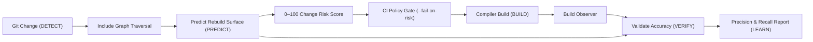

# CompileForge

## Know the rebuild cost and blast radius of a C++ code change before you merge it.

[](https://en.cppreference.com/w/cpp/20)
[](docs/DEVELOPMENT.md#3-testing--invariants)
[](docs/DEVELOPMENT.md#7-engineering-conventions)
[](LICENSE)

**CompileForge** is a native C++20, zero-runtime-dependency build intelligence and change-impact analysis toolkit. It bridges:

$$\text{Git Changes} \longrightarrow \text{Dependency Graph} \longrightarrow \text{Rebuild Surface} \longrightarrow \text{Risk Score} \longrightarrow \text{Build Observation} \longrightarrow \text{Prediction Validation}$$

> [!NOTE]
> CompileForge evaluates dependency blast radius via **fast static lexical preprocessor analysis** (>5.3M lines/sec). Predictions represent the potential static rebuild surface rather than a guarantee of compiler caching or AST-level compilation skipping.

---

## Why CompileForge?

In medium-to-large C++ codebases, a single modification to a shared header can trigger hundreds of downstream translation unit rebuilds, inflate CI queue times, and introduce architectural regressions.

CompileForge provides answers before code is merged:

- **What will this change affect?** Traces Git revision diffs through `#include` dependency graphs to identify transitively affected translation units.
- **How much of the project will rebuild?** Computes estimated rebuild surface percentages and dependency depths.
- **Which files deserve extra review?** Ranks modified files by architectural centrality and transitive fan-in bottlenecks.
- **Can we gate CI on change risk?** Provides an explainable 0–100 Change Risk Score with automated CI thresholds (`--fail-on-risk <N>`).
- **Did the prediction match reality?** Validates predicted rebuild surfaces against actual compiler build logs to compute precision and recall.

---

## Visual Reports

CompileForge generates standalone, responsive HTML dashboards designed in a **Mid-Century Modern Technical Editorial** aesthetic:

### Change-Impact Report (`compileforge impact`)
Forecasts affected translation units, rebuild surface percentage, and review hotspots from a Git diff:


### Prediction Validation Report (`compileforge validate`)
Contrasts predicted blast radius against actual compiler build logs to verify precision and surface error deltas:


---

## Core Workflow



---

## Quick Start

### Build from Source
```bash
# Clone repository
git clone https://github.com/Destroyer795/compileforge.git
cd compileforge

# Configure and compile with Ninja (Release mode)
cmake -B build -G Ninja -DCMAKE_BUILD_TYPE=Release
cmake --build build

# Run automated test suite (41/41 tests passing)
./build/compileforge_tests
```

### End-to-End Command Example

```bash
# 1. Predict change impact of a branch against main
./build/compileforge impact . origin/main..HEAD --format json --output prediction.json

# 2. Run your build while capturing compiler output
ninja -v > build.log 2>&1

# 3. Validate predicted rebuild surface against actual compiler activity
./build/compileforge validate prediction.json --log build.log --format html --output validation.html
```

---

## What CompileForge Is / Is Not

| CompileForge IS | CompileForge IS NOT |
| :--- | :--- |
| **Zero runtime dependencies** (Pure ISO C++20 & STL). | **Not a full C++ compiler** (uses lexical preprocessor analysis, not semantic ASTs). |
| **Git-aware change-impact analyzer** (traces commit diffs). | **Not a replacement for profilers** (e.g. Clang `-ftime-trace` or MSVC Build Insights). |
| **CI policy gating tool** (`--fail-on-risk`, `--fail-on-cycle`). | **Not a guarantee of compiler caching** (`ccache`/PCH may alter actual recompilation). |
| **Closed-loop prediction validator** (verifies predictions). | **Not a defect predictor** (risk reflects build surface and blast radius, not bugs). |

---

## Performance & Testing

- **JSON Parser Throughput**: 187.15 MB/s
- **Preprocessor Lexer Speed**: 5,385,355 lines/sec
- **260-File Project Scan & Graph**: 1.46 seconds
- **Test Suite**: 41/41 automated tests passing (**100% pass rate in ~215 ms**).

---

## Documentation

- [Getting Started](docs/GETTING_STARTED.md) — Installation, first analysis, first impact run, and validation basics.
- [System Architecture & Data Flow](docs/ARCHITECTURE.md) — Subsystem layers, dependency graphs, and sequence diagrams.
- [Change-Impact Engine](docs/CHANGE_IMPACT.md) — Propagation algorithms, risk models (0–100), and topology metrics.
- [CLI Reference & Configuration](docs/CLI.md) — Command syntax, `.compileforge.json` schema, exit codes, and JSON formats.
- [Prediction Validation](docs/VALIDATION.md) — Accuracy formulations ($TP, FP, FN$, precision, recall) and demonstration walkthrough.
- [Technical Limitations](docs/LIMITATIONS.md) — Explicit technical boundaries, compiler differences, and operating scope.
- [Developer Guide](docs/DEVELOPMENT.md) — Build options, 41 test cases, CI integration, and benchmarks.

---

## License

CompileForge is released under the [MIT License](LICENSE).
