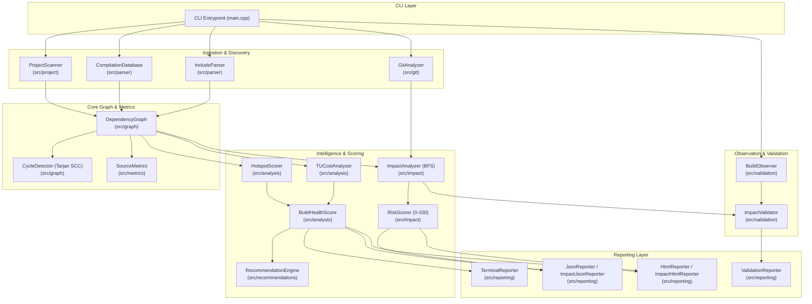

# CompileForge System Architecture Specification

CompileForge is a native C++20, zero-runtime-dependency build intelligence and change-impact analysis toolkit. It bridges Git revision history, preprocessor inclusion graphs, compilation databases, and compiler build logs.

---

## 1. Architectural Goals

1. **Native C++20 Implementation**: Leverages modern ISO C++20 standard library facilities (concepts, `std::filesystem`, `std::string_view`, `std::optional`, `std::variant`).
2. **Zero Runtime Dependencies**: Handcrafted JSON parser, preprocessor lexer, and graph algorithms without external dependencies (no Boost, no third-party JSON/graph libraries).
3. **Deterministic & Explainable**: Identical inputs produce identical graph traversals, risk scores, and recommendations. All risk and health scores are backed by explicit data-driven reason arrays.
4. **Closed-Loop Workflow**: Connects change prediction (`compileforge impact`) with actual build observation and validation (`compileforge validate`).
5. **CI Automation Ready**: Native policy thresholds (`--fail-on-risk <N>`, `--fail-on-cycle`), predictable exit codes, and machine-readable JSON outputs.

---

## 2. Layered Subsystem Architecture

---

## 3. Subsystem Breakdown

### 1. Ingestion Layer (`compileforge::parser`, `compileforge::git`, `compileforge::project`)
- `ProjectScanner`: Recursively traverses directories, recognizing C++ sources and headers while filtering ignore patterns (`.compileforge.json`).
- `CompilationDatabase`: Ingests standard Clang `compile_commands.json` files, extracting compiler binary paths, language standards (`-std=c++20`), include search paths (`-I`), preprocessor definitions (`-D`), and optimization levels.
- `IncludeParser`: High-throughput preprocessor lexer (>5.3M lines/sec) extracting `#include` directives, `#pragma once`, and `#ifndef` guards, while bypassing inactive `#if 0` code sections.
- `GitAnalyzer`: Parses Git revision diffs (`git diff --name-status -M`) to identify modified, added, renamed, or deleted files.

### 2. Graph & Topology Layer (`compileforge::graph`, `compileforge::metrics`)
- `DependencyGraph`: Directed graph modeling preprocessor dependencies (`caller -> callee`). Computes direct and transitive fan-in (centrality) and fan-out (breadth).
- `CycleDetector`: Computes Strongly Connected Components via Tarjan's algorithm in $O(V + E)$ linear time to detect circular inclusion loops.

### 3. Change-Impact & Risk Engine (`compileforge::impact`)
- `ImpactAnalyzer`: Propagates changes outward along incoming dependent edges using breadth-first search (BFS) to compute the set of affected translation units, maximum dependency depth, and rebuild surface percentage.
- `RiskScorer`: Evaluates an explainable 0–100 Change Risk Score across six factors (Impact, Depth/Cost, Architecture/Centrality, Churn, Complexity, Cycles) and generates data-backed "Why Risky" justification points.

### 4. Build Observation & Validation Engine (`compileforge::validation`)
- `BuildObserver`: Captures and parses actual compiler build activity from live build commands or Ninja/Make/GCC/Clang build logs.
- `ImpactValidator`: Calculates statistical accuracy metrics ($TP, FP, FN$, precision, recall, rebuild surface error delta) to validate predictions against actual compiler builds.
