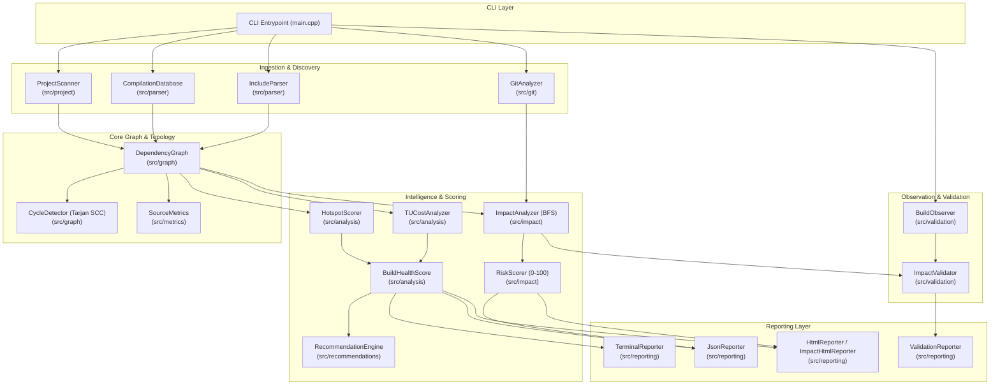
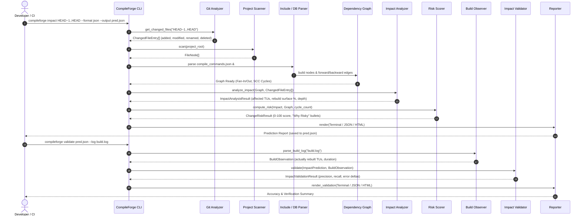

# CompileForge Architecture & Data Flow

CompileForge is a native C++20, zero-runtime-dependency build intelligence and change-impact analysis toolkit. It bridges Git revision history, preprocessor inclusion graphs, compilation databases, and compiler build logs.

---

## 1. Design Goals

1. **Native C++20 Implementation**: Leverages modern standard library facilities (concepts, `std::filesystem`, `std::string_view`, `std::optional`, `std::variant`).
2. **Zero Runtime Dependencies**: Handcrafted JSON parser, preprocessor lexer, and graph algorithms without external dependencies (no Boost, no third-party JSON or graph libraries).
3. **Deterministic & Explainable**: Identical inputs produce identical graph traversals, risk scores, and recommendations. All risk and health scores are backed by explicit data-driven reason arrays.
4. **Closed-Loop Workflow**: Connects change prediction (`compileforge impact`) with actual build observation and validation (`compileforge validate`).
5. **CI Automation Ready**: Native policy thresholds (`--fail-on-risk <N>`, `--fail-on-cycle`), predictable exit codes, and machine-readable JSON outputs.

---

## 2. System Architecture

---

## 3. Subsystem Breakdown

### 1. Ingestion Layer (`compileforge::parser`, `compileforge::git`, `compileforge::project`)
- `ProjectScanner`: Recursively traverses directory trees, recognizing C++ sources and headers while filtering ignore patterns from `.compileforge.json`.
- `CompilationDatabase`: Ingests standard Clang `compile_commands.json` files, extracting compiler binary paths, language standards (`-std=c++20`), include search paths (`-I`), preprocessor definitions (`-D`), and optimization levels.
- `IncludeParser`: High-throughput preprocessor lexer (>5.3M lines/sec) extracting `#include` directives, `#pragma once`, and `#ifndef` guards, while bypassing inactive `#if 0` code sections.
- `GitAnalyzer`: Parses Git revision diffs (`git diff --name-status -M`) to identify modified, added, renamed, or deleted files.

### 2. Graph & Topology Layer (`compileforge::graph`, `compileforge::metrics`)
- `DependencyGraph`: Directed graph modeling preprocessor dependencies (`caller -> callee`). Computes direct and transitive fan-in (centrality) and fan-out (breadth).
- `CycleDetector`: Computes Strongly Connected Components via Tarjan's algorithm in $O(V + E)$ linear time to detect circular inclusion loops.
- `SourceMetrics`: Computes line counts (SLOC, blank, comment), preprocessor density, and cyclomatic complexity.

### 3. Change-Impact & Risk Engine (`compileforge::impact`, `compileforge::analysis`)
- `ImpactAnalyzer`: Propagates changes outward along incoming dependent edges using breadth-first search (BFS) to compute the set of affected translation units, maximum dependency depth, and rebuild surface percentage.
- `RiskScorer`: Evaluates an explainable 0–100 Change Risk Score across six factors (Impact, Depth/Cost, Architecture/Centrality, Churn, Complexity, Cycles) and generates data-backed justification points.
- `HotspotScorer`: Evaluates compilation cost, transitive fan-in, complexity, and commit frequency.
- `BuildHealthScore`: Rates overall repository build configuration quality on a 0–100 scale.
- `RecommendationEngine`: Generates prioritized, actionable refactoring steps.

### 4. Build Observation & Validation Engine (`compileforge::validation`)
- `BuildObserver`: Captures and parses compiler build activity from live build commands or Ninja/Make/GCC/Clang build logs.
- `ImpactValidator`: Calculates statistical accuracy metrics ($TP, FP, FN$, precision, recall, rebuild surface error delta) to validate predictions against actual compiler builds.

### 5. Reporting Layer (`compileforge::reporting`)
- `TerminalReporter`: ANSI-colored visual summary cards with tables and indicators.
- `JsonReporter`: Machine-readable payloads conforming to versioned schemas (`1.0_impact`, `1.0_validation`).
- `HtmlReporter` / `ImpactHtmlReporter` / `ValidationReporter`: Standalone single-file HTML reports using a Mid-Century Modern Technical Editorial visual design.

---

## 4. End-to-End Data Flow

### Change-Impact & Prediction Validation Sequence

### Whole-Project Analysis Flow (`compileforge analyze`)

1. **Discovery**: `ProjectScanner` traverses the directory tree, applying ignore rules from `.compileforge.json`.
2. **Compilation Flags**: `CompilationDatabase` parses compiler invocation flags from `compile_commands.json` (extracting search directories, `-std=`, `-O`, defines).
3. **Lexical Parsing**: `IncludeParser` extracts `#include` directives, skipping inactive `#if 0` code blocks.
4. **Graph Construction**: `DependencyGraph` registers files as nodes and includes as directed edges (`caller -> callee`).
5. **Topology Metrics**: Computes fan-in, fan-out, dependency depth, and Tarjan's SCC cycles.
6. **Health Scoring**: `BuildHealthScorer` evaluates flag consistency and structural health (0–100).
7. **Action Plan**: `RecommendationEngine` generates prioritized refactoring recommendations.
