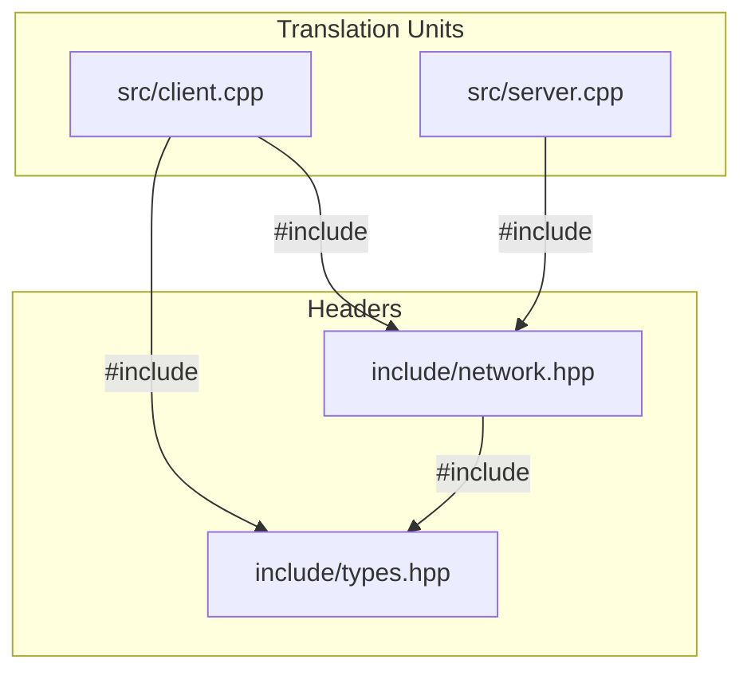
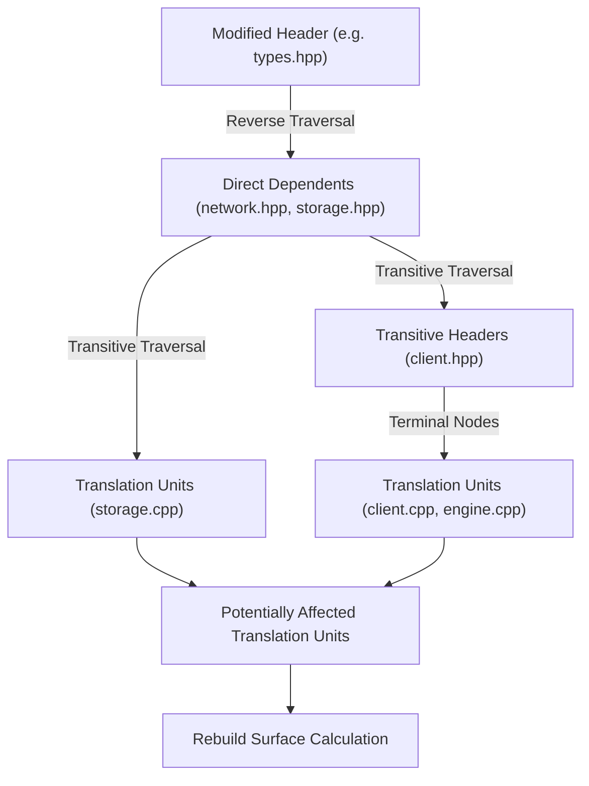

# CompileForge Change-Impact & Dependency Analysis Engine

The Change-Impact engine in CompileForge determines the rebuild surface and architectural blast radius of code modifications before they are compiled or merged.

---

## 1. Graph Model & Inclusion Topology

CompileForge constructs an explicit directed graph representing the preprocessor `#include` topology of C++ source files and headers:

In the internal representation (`compileforge::DependencyGraph`):
- **Outgoing Edges (`outgoing_edges_`)**: Maps a file to its direct includes (`file -> dependencies`).
- **Incoming Edges (`incoming_edges_`)**: Maps a header to its direct dependents (`file -> dependents`).

### Topological Metrics

- **Direct Fan-In**: Number of files directly `#include`-ing a given header.
- **Transitive Fan-In (Centrality)**: Total unique files (translation units and intermediate headers) depending on this header across all inclusion depths. High transitive fan-in identifies architectural bottlenecks with large recompilation blast radii.
- **Direct Fan-Out**: Number of headers directly included by a source file.
- **Transitive Fan-Out (Inclusion Breadth)**: Total unique headers pulled into the preprocessed translation unit.
- **Circular Inclusion Detection (Tarjan's SCC)**: Computes Strongly Connected Components in $O(V + E)$ linear time. Any SCC with $|V| > 1$ represents an architectural circular dependency loop (`A.hpp -> B.hpp -> C.hpp -> A.hpp`).

---

## 2. Change Propagation Algorithm

### Algorithm Steps:

1. **Seed Initialization**: Load the list of modified, added, or renamed files from the Git revision diff (`git diff --name-status -M`).
2. **Breadth-First Dependents Traversal (BFS)**:
   - For each changed file, traverse outward along **incoming graph edges** (`incoming_edges_`).
   - Track `distance` (dependency depth) and `visited` nodes to prevent cycles or redundant visits.
3. **Classification**:
   - Nodes ending in `.cpp`, `.cc`, or `.cxx` are categorized as **Potentially Affected Translation Units**.
   - Nodes ending in `.h`, `.hpp`, or `.hxx` are categorized as **Affected Intermediate Headers**.
4. **Rebuild Surface Calculation**:
   $$\text{Estimated Rebuild Surface \%} = \frac{|\text{Affected Translation Units}|}{|\text{Total Project Translation Units}|} \times 100$$

---

## 3. Change Risk Scoring Model (0–100)

CompileForge computes an explainable **0–100 Change Risk Score** across six weighted architectural factors:

$$\text{Risk Score} = w_{\text{impact}} \cdot S_{\text{impact}} + w_{\text{depth}} \cdot S_{\text{depth}} + w_{\text{arch}} \cdot S_{\text{arch}} + w_{\text{churn}} \cdot S_{\text{churn}} + w_{\text{cmplx}} \cdot S_{\text{cmplx}} + w_{\text{cycle}} \cdot S_{\text{cycle}}$$

| Factor | Weight | Description |
| :--- | :--- | :--- |
| **Blast Radius ($S_{\text{impact}}$)** | 35% | Rebuild surface percentage relative to total project translation units. |
| **Depth & Cost ($S_{\text{depth}}$)** | 20% | Maximum dependency traversal depth and estimated compilation weight. |
| **Architecture Centrality ($S_{\text{arch}}$)** | 15% | Transitive fan-in of modified headers (bottleneck severity). |
| **Commit Churn ($S_{\text{churn}}$)** | 10% | Historical commit modification frequency for modified files. |
| **Preprocessor Complexity ($S_{\text{cmplx}}$)** | 10% | Macro definition count and cyclomatic control statement density. |
| **Cycle Involvement ($S_{\text{cycle}}$)** | 10% | Presence of modified files within circular inclusion loops. |

### Risk Tiers
- **LOW** (0–24): Localized changes with minimal downstream impact.
- **MODERATE** (25–49): Multi-module changes touching intermediate headers.
- **HIGH** (50–74): Significant blast radius affecting core interfaces.
- **CRITICAL** (75–100): Wide-surface changes to central architectural headers or cycle-involved files.

> [!NOTE]
> The Change Risk Score is an **architectural prioritization heuristic** to guide code review and CI gating, NOT a mathematical probability of software defects.

---

## 4. Whole-Project Health & Cost Models

### Build Health Score (0–100)
Rates overall repository build configuration quality:
- **Base Score**: 100
- **Deductions**:
  - **-15 points** per circular dependency loop.
  - **-10 points** per build configuration health finding (e.g. inconsistent `-O` flags or missing warning flags).
  - **-5 points** per high fan-in header (>20 transitive dependents).

### Translation Unit Cost Model
Translation units are classified into cost tiers (`LOW`, `MEDIUM`, `HIGH`, `CRITICAL`) based on:

$$\text{Cost Score} = 0.2 \times \text{SLOC} + 5.0 \times \text{Transitive Headers} + 2.0 \times \text{Macros} + 3.0 \times \text{Templates}$$

- **LOW**: Score < 50
- **MEDIUM**: Score 50–149
- **HIGH**: Score 150–299
- **CRITICAL**: Score $\ge$ 300

---

## 5. Edge Case Handling

- **Deleted Files**: Checked against the graph; dependents that attempt to `#include` deleted files are flagged as requiring review.
- **Renamed Files**: Followed via Git's `-M` similarity heuristics; old paths are mapped to new paths.
- **Circular Inclusion Loops**: Visited sets guarantee $O(V + E)$ termination without infinite loops.
- **Deterministic Traversal**: Dependent lists and JSON outputs are sorted alphabetically to guarantee identical results across runs.
- **Lexical Preprocessor Scope**: CompileForge performs fast static lexical analysis (>5.3M lines/sec). It parses `#include`, `#pragma once`, `#ifndef` guards, and skips `#if 0` blocks. It does not perform full C++ semantic AST compilation.
