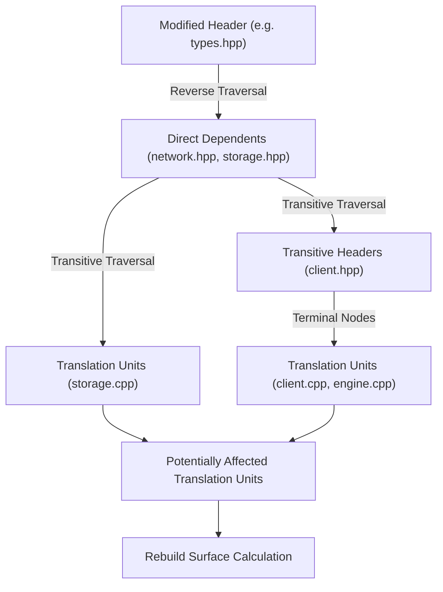

# CompileForge Change-Impact Analysis Engine

The Change-Impact engine in CompileForge determines the rebuild surface and architectural blast radius of code modifications before they are merged or compiled.

---

## 1. Propagation Algorithm

### Algorithm Steps:
1. **Seed Initialization**: Load the list of modified, added, or renamed files from the Git revision diff (`git diff --name-status -M`).
2. **Breadth-First Dependents Traversal (BFS)**:
   - For each changed file, traverse outward along **incoming graph edges** (`incoming_edges_`).
   - Track `distance` (dependency depth) and `visited` nodes to prevent cycles or redundant visits.
3. **Classification**:
   - Nodes ending in `.cpp`, `.cc`, or `.cxx` are flagged as **Potentially Affected Translation Units**.
   - Nodes ending in `.h`, `.hpp`, `.hxx` are flagged as **Affected Intermediate Headers**.
4. **Rebuild Surface Metric**:
   $$\text{Estimated Rebuild Surface \%} = \frac{|\text{Affected TUs}|}{|\text{Total Project TUs}|} \times 100$$

---

## 2. Edge Case Handling

- **Deleted Files**: Checked against the graph; dependents that attempt to `#include` deleted files are flagged as requiring review.
- **Renamed Files**: Followed via Git's `-M` similarity heuristics; old paths are mapped to new paths.
- **Circular Inclusion Loops**: Visited sets guarantee $O(V + E)$ termination without infinite loops.
- **Deterministic Traversal**: Dependent lists are sorted alphabetically to guarantee identical output across runs.
