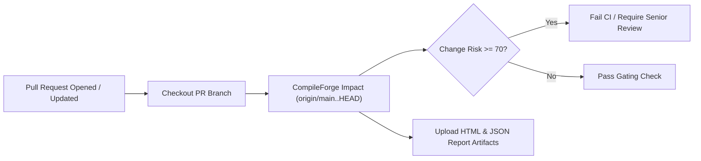

# Continuous Integration & Pull Request Gating

CompileForge can run directly inside automated CI/CD pipelines (e.g. GitHub Actions, GitLab CI, Jenkins) to evaluate the build-cost and architectural risk of pull requests before merge.

---

## 1. Pull Request Gating Workflow



---

## 2. GitHub Actions Integration Example

```yaml
name: CompileForge Change-Impact Gate

on:
  pull_request:
    branches: [ main ]

jobs:
  impact-gate:
    runs-on: ubuntu-latest

    steps:
      - name: Checkout Code with History
        uses: actions/checkout@v3
        with:
          fetch-depth: 0

      - name: Install Build Tools
        run: sudo apt-get update && sudo apt-get install -y cmake ninja-build g++

      - name: Build CompileForge
        run: |
          cmake -B build-cf -G Ninja -DCMAKE_BUILD_TYPE=Release
          cmake --build build-cf

      - name: Run Change-Impact Risk Gate
        run: |
          ./build-cf/compileforge impact . origin/main..HEAD \
            --format html --output compileforge_impact.html \
            --fail-on-risk 70

      - name: Upload Impact Dashboard Artifact
        if: always()
        uses: actions/upload-artifact@v3
        with:
          name: compileforge-impact-report
          path: compileforge_impact.html
```
