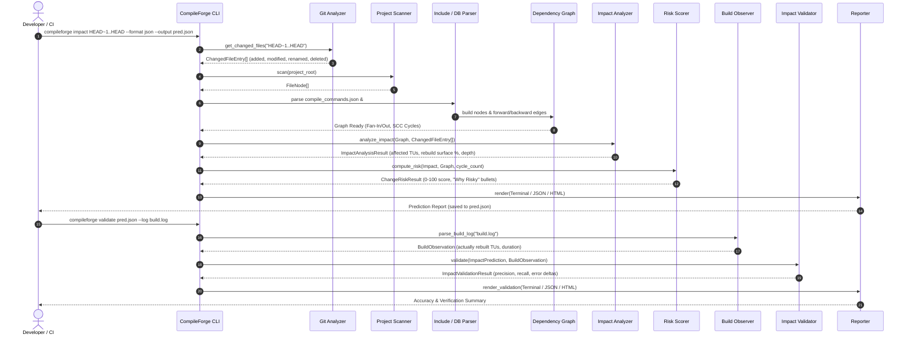

# CompileForge Data Flow Architecture

This document describes how data moves through CompileForge during whole-project analysis and change-impact workflows.

---

## 1. Change-Impact & Prediction Validation Sequence

The following sequence diagram details the end-to-end flow from Git revision diffing to observed build validation:

---

## 2. Project Analysis Data Flow (`compileforge analyze`)

When analyzing a full codebase:

1. **Discovery**: `ProjectScanner` traverses the directory tree, applying ignore rules from `.compileforge.json`.
2. **Compilation Flags**: `CompilationDatabase` parses compiler invocation flags from `compile_commands.json` (extracting search directories, `-std=`, `-O`, defines).
3. **Lexical Parsing**: `IncludeParser` extracts `#include` directives, skipping inactive `#if 0` code blocks.
4. **Graph Construction**: `DependencyGraph` registers files as nodes and includes as directed edges (`caller -> callee`).
5. **Topology Metrics**: Computes fan-in, fan-out, dependency depth, and Tarjan's SCC cycles.
6. **Health Scoring**: `BuildHealthScorer` evaluates flag consistency and structural health (0–100).
7. **Action Plan**: `RecommendationEngine` generates prioritized refactoring recommendations.
