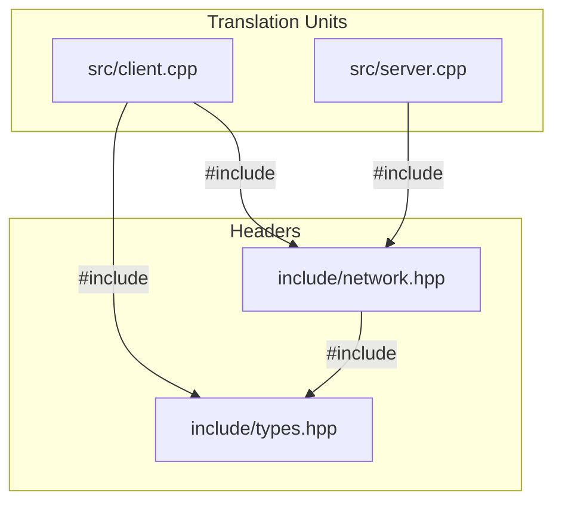

# CompileForge Dependency Graph & Topology Analysis

CompileForge constructs an explicit directed graph representing the preprocessor `#include` topology of C++ source files and headers.

---

## 1. Graph Model & Representation

In the CompileForge internal representation (`compileforge::DependencyGraph`):
- **Outgoing Edges (`outgoing_edges_`)**: Maps a file to its direct includes (`file -> dependencies`).
- **Incoming Edges (`incoming_edges_`)**: Maps a header to its direct dependents (`file -> dependents`).

---

## 2. Topological Metrics

### Fan-In (Centrality)
- **Direct Fan-In**: Number of files directly `#include`-ing this header.
- **Transitive Fan-In**: Total unique files (including translation units and other headers) that depend on this header across all inclusion depths. High transitive fan-in indicates an architectural hotspot with a large recompilation blast radius.

### Fan-Out (Inclusion Breadth)
- **Direct Fan-Out**: Number of headers directly included by a source file.
- **Transitive Fan-Out**: Total unique headers pulled into the preprocessed translation unit.

### Circular Inclusion Loop Detection (Tarjan's SCC)
CompileForge uses Tarjan's Strongly Connected Components (SCC) algorithm to detect circular inclusion cycles (`A.hpp -> B.hpp -> C.hpp -> A.hpp`) in linear time $O(V + E)$. Any SCC with $|V| > 1$ represents an architectural circular dependency loop that degrades compile times and prevents modularization.

---

## 3. Static Lexical Scope & Limitations

> [!NOTE]
> CompileForge performs **fast static lexical analysis** (>5.3M lines/sec) of preprocessor directives. It parses `#include`, `#pragma once`, `#ifndef` guards, and skips `#if 0` dead blocks. It does not evaluate dynamic macros or compiler-defined conditional switches outside `#if 0`.
