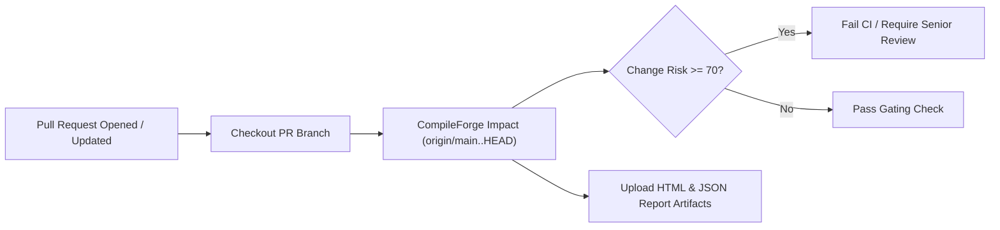

# CompileForge Developer Guide

This guide details the repository layout, build configuration, testing procedures, performance benchmarks, CI integration, and engineering conventions for developers contributing to CompileForge.

---

## 1. Repository Layout

```
CompileForge/
├── include/compileforge/     # Public C++20 Header API
│   ├── analysis/             # Hotspot, TU cost, health score, regression analyzers
│   ├── build/                # Build trace and timing utilities
│   ├── cache/                # Graph analysis caching
│   ├── config/               # .compileforge.json parser and configuration
│   ├── core/                 # Result<T>, JsonValue, string/path utils, types
│   ├── git/                  # Git diff parser and revision resolver
│   ├── graph/                # DependencyGraph, CycleDetector (Tarjan SCC)
│   ├── impact/               # ImpactAnalyzer (BFS), RiskScorer (0-100 heuristic)
│   ├── metrics/              # Line counts, complexity, and source metrics
│   ├── parser/               # CompilationDatabase, CompilerInvocation, IncludeParser
│   ├── project/              # ProjectScanner directory discovery
│   ├── recommendations/      # Priority refactoring recommendation engine
│   ├── reporting/            # Terminal, JSON, HTML, Impact, and Validation reporters
│   └── validation/           # ImpactValidator, BuildObserver, prediction models
├── src/                      # Source implementation files (.cpp)
├── tests/                    # Unit, integration, invariant, and property tests
│   ├── unit/                 # Subsystem unit tests
│   └── integration/          # End-to-end multi-module integration tests
├── benchmarks/               # Performance benchmark runner
├── examples/                 # Self-contained demo fixtures
│   ├── circular_includes/    # Circular dependency demonstration fixture
│   ├── impact_demo_app/      # Multi-module change-impact demonstration fixture
│   ├── monolith_app/         # Multi-module architectural health demo fixture
│   └── synthetic_large_project/ # 260-file multi-tier benchmark fixture
├── evaluations/              # External evaluation harness
├── docs/                     # Technical architecture, CLI, validation, and guides
├── CMakeLists.txt            # Root CMake build definition
└── README.md                 # Product overview and front door
```

### Include Architecture & Dual-Mode Design
CompileForge uses an intentional dual-mode include structure designed for standard library distribution and modular translation-unit independence:
- **Public SDK Headers (`include/compileforge/...`)**: Retain the canonical `<compileforge/...>` namespace contract for external consumers while using clean, self-contained intra-library references between headers. Downstream consumers include `<compileforge/core/result.hpp>`, `<compileforge/graph/dependency_graph.hpp>`, etc., using standard `-Iinclude`.
- **Internal Implementation Units (`src/`, `tests/`, `benchmarks/`)**: Use repository-relative references to the canonical `include/compileforge/` headers so individual implementation files remain independently discoverable and compilable in isolated translation-unit environments.
- **Authoritative Build**: CMake remains the primary, authoritative build system orchestrating library compilation, executables, compiler optimizations, and test suites.

---

## 2. Building from Source

### Prerequisites
- **C++20 Compiler**: GCC 11+, Clang 13+, or MSVC 2019+ (16.10+)
- **Build System**: CMake 3.20+ and Ninja or Make
- **Git**: Git 2.20+

### Clean Build Commands
```bash
# Clone the repository
git clone https://github.com/Destroyer795/compileforge.git
cd compileforge

# Configure and compile with Ninja in Release mode
cmake -B build -G Ninja -DCMAKE_BUILD_TYPE=Release
cmake --build build
```

### CMake Build Options

| Option | Default | Description |
| :--- | :--- | :--- |
| `COMPILEFORGE_BUILD_TESTS` | `ON` | Build the automated test runner (`compileforge_tests`) |
| `COMPILEFORGE_BUILD_BENCHMARKS` | `ON` | Build the performance benchmark runner (`compileforge_benchmarks`) |
| `COMPILEFORGE_ENABLE_WARNINGS_AS_ERRORS` | `OFF` | Treat compiler warnings as build errors |

---

## 3. Testing & Invariants

CompileForge maintains a zero-external-dependency test suite verifying algorithmic invariants, data structures, parsing robustness, and end-to-end workflows:

```bash
# Execute test suite via CTest
ctest --test-dir build --output-on-failure

# Or execute the test binary directly
./build/compileforge_tests
```

### Test Suite Structure (41 Test Cases)

- **Unit Tests**:
  - `test_json`: JSON primitive parsing, serialization, and error recovery on malformed input.
  - `test_scanner`: Directory traversal, file kind detection, and ignore pattern matching.
  - `test_compilation_database`: Clang compilation database ingestion and flag extraction.
  - `test_compiler_invocation`: Tokenization of `-std=`, `-O`, `-I`, `-D`, and warnings.
  - `test_include_parser`: Directive parsing, `#pragma once`, include guards, and `#if 0` skipping.
  - `test_dependency_graph`: Node registration, fan-in/fan-out statistics, and graph duality.
  - `test_cycle_detector`: Tarjan SCC cycle identification and circular include reporting.
  - `test_source_metrics`: LOC, comments, preprocessor count, and cyclomatic complexity.
  - `test_hotspot`: Multi-variate hotspot ranking and risk categorization.
  - `test_build_config_health`: Detection of flag mismatches and inconsistent standards.
  - `test_tu_cost`: Translation unit cost classification and memory/CPU heuristics.
  - `test_build_health_score`: 0–100 weighted health score computation.
  - `test_impact_analyzer`: Forward dependent propagation and rebuild surface calculations.
  - `test_risk_scorer`: Determinism, monotonicity, and boundary testing of 0–100 risk score.
  - `test_git_diff`: Revision diff parsing, rename detection, and non-repo resilience.
  - `test_validation_model`: True/false positives, precision, recall, and build log parsing.
  - `test_impact_invariants`: Graph reachability invariants for all reported affected nodes.
- **Integration Tests**:
  - `test_end_to_end`: Full pipeline runs on synthetic monolith and circular inclusion fixtures.
- **Robustness Tests**:
  - `test_malformed_inputs`: Graceful error recovery on corrupt JSON, missing databases, and invalid paths.

---

## 4. Performance Benchmarks

CompileForge includes a standalone benchmark runner compiled into `compileforge_benchmarks`:

```bash
./build/compileforge_benchmarks
```

### Measured Benchmark Results
*(Measured on Linux x86_64, GCC 11.4.0, Release build with `-O3`)*

| Subsystem | Measured Speed / Throughput | Scope |
| :--- | :--- | :--- |
| **JSON Parser Engine** | **187.15 MB/s** | Iterative ingestion of synthetic compilation database payloads (20 iterations, 10.80 ms). |
| **Preprocessor Lexer** | **5,385,355 lines/sec** | Lexical scanning of `#include`, include guards, and `#if 0` blocks (55.71 ms). |
| **Project Scan & Graph** | **1,464.62 ms** | Traversal, database parsing, and include graph construction for 260 files. |

---

## 5. Continuous Integration (CI) Integration

CompileForge can run directly inside automated CI/CD pipelines to evaluate the build-cost and architectural risk of pull requests before merge.



### GitHub Actions Workflow Example

```yaml
name: CompileForge Change-Impact Gate

on:
  pull_request:
    branches: [ main ]

jobs:
  impact-gate:
    runs-on: ubuntu-latest

    steps:
      - name: Checkout Code with History
        uses: actions/checkout@v3
        with:
          fetch-depth: 0

      - name: Install Build Tools
        run: sudo apt-get update && sudo apt-get install -y cmake ninja-build g++

      - name: Build CompileForge
        run: |
          cmake -B build-cf -G Ninja -DCMAKE_BUILD_TYPE=Release
          cmake --build build-cf

      - name: Run Change-Impact Risk Gate
        run: |
          ./build-cf/compileforge impact . origin/main..HEAD \
            --format html --output compileforge_impact.html \
            --fail-on-risk 70

      - name: Upload Impact Dashboard Artifact
        if: always()
        uses: actions/upload-artifact@v3
        with:
          name: compileforge-impact-report
          path: compileforge_impact.html
```

---

## 6. Troubleshooting Common Development Issues

| Issue | Cause | Solution |
| :--- | :--- | :--- |
| `Compilation database not found` | Build system did not export commands | Re-run CMake with `-DCMAKE_EXPORT_COMPILE_COMMANDS=ON` |
| `Failed to execute git diff` | Branch reference missing in shallow clone | Use `actions/checkout@v3` with `fetch-depth: 0` |
| `Observed Rebuilt TUs: 0` | Build tool output was not verbose | Capture compiler commands: `ninja -v > build.log 2>&1` |
| `CTest: Missing -C <config>` | Multi-config generator on Windows MSVC | Run `ctest -C Release` or pass `--build-config Release` |

---

## 7. Engineering Conventions

1. **Zero External Runtime Dependencies**: Standard ISO C++20 and STL only. Do not link third-party libraries into the core binary.
2. **Explicit Error Handling**: Use `compileforge::Result<T>` rather than throwing C++ exceptions across module boundaries.
3. **Deterministic Output**: All dependency lists, node sets, and JSON properties must maintain sorted, deterministic ordering.
4. **Honest Metrics**: Tag all output metrics explicitly (`MEASURED`, `ESTIMATED`, `OBSERVED`, `HEURISTIC`, `UNAVAILABLE`).
