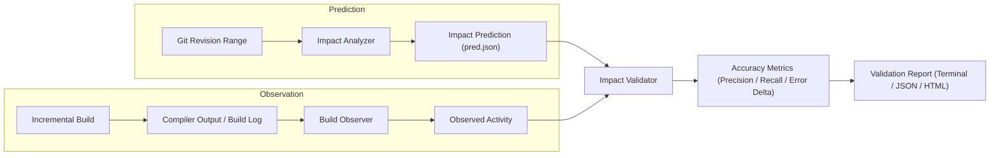

# CompileForge Prediction Validation Engine

CompileForge implements a closed-loop validation engine that compares **predicted change-impact blast radius** against **actually observed compiler activity**.

---

## 1. Validation Architecture



---

## 2. Accuracy Metrics Formulation

CompileForge evaluates predictions against observed builds using standard statistical metrics:

- **True Positives ($TP$)**: Translation units predicted to be affected that were actually compiled by the build system.
- **False Positives ($FP$)**: Translation units predicted to be affected that were *not* compiled (e.g. skipped by compiler caching tools or conditional includes).
- **False Negatives ($FN$)**: Translation units compiled by the build system that were *not* predicted by CompileForge.

### Precision
$$\text{Precision} = \frac{TP}{TP + FP} \times 100\%$$
*(Reported as `UNAVAILABLE` if no translation units were predicted.)*

### Recall
$$\text{Recall} = \frac{TP}{TP + FN} \times 100\%$$
*(Reported as `UNAVAILABLE` if no translation units were observed to rebuild.)*

### Rebuild Surface Error Delta
$$\text{Rebuild Surface Error Delta} = |\text{Predicted Rebuild Surface \%} - \text{Observed Rebuild Surface \%}|$$

### Build-Cost Error Delta
$$\text{Build-Cost Error Delta} = \frac{|\text{Predicted Seconds} - \text{Observed Seconds}|}{\text{Observed Seconds}} \times 100\%$$
*(Reported as `UNAVAILABLE` when historical `-ftime-trace` logs are not present.)*

---

## 3. Demonstration Case Study

The following walkthrough demonstrates the validation workflow on the included demonstration fixture (`examples/impact_demo_app`).

### Target Scenario
- A modular C++20 app with a shared data contract: `include/core/types.hpp`.
- Three translation units: `src/network/client.cpp`, `src/storage/db.cpp`, and `src/render/engine.cpp`.
- A modification is made to `include/core/types.hpp`.

### Execution Commands
```bash
# 1. Generate prediction
./build/compileforge impact ./examples/impact_demo_app HEAD~1..HEAD \
    --format json --output examples/impact_demo_app/prediction.json

# 2. Execute actual compiler build while capturing output
cd examples/impact_demo_app
g++ -Iinclude -std=c++20 -c src/network/client.cpp -o src/network/client.o > build.log 2>&1
g++ -Iinclude -std=c++20 -c src/storage/db.cpp -o src/storage/db.o >> build.log 2>&1
g++ -Iinclude -std=c++20 -c src/render/engine.cpp -o src/render/engine.o >> build.log 2>&1
cd ../..

# 3. Validate prediction against build log
./build/compileforge validate examples/impact_demo_app/prediction.json \
    --log examples/impact_demo_app/build.log
```

### Measured Demonstration Output
```
==========================================================
             CHANGE IMPACT PREDICTION VALIDATION          
==========================================================

PREDICTION VS OBSERVATION
  Predicted Affected TUs:      3 [ESTIMATED]
  Observed Rebuilt TUs:        3 [OBSERVED]
  True Positives (Correct):    3
  False Positives (Over-pred): 0
  False Negatives (Missed):    0

ACCURACY METRICS
  Prediction Precision:        100.0%
  Prediction Recall:           100.0%
  Rebuild Surface Error Delta: 0.0%
  Build-Cost Error Delta:      UNAVAILABLE (No historical build timings)
  Overall Accuracy Rating:     EXCELLENT
==========================================================
```

> [!NOTE]
> **Demonstration Scope Disclaimer**: The 100% precision and recall reported above was measured on this controlled 3-TU demonstration fixture. This metric demonstrates algorithmic correctness on this test case and is **not an assertion of generalized statistical accuracy across arbitrary external codebases**.

---

## 4. Evidence Classification Policy

CompileForge strictly distinguishes between different categories of information:

| Tag | Meaning |
| :--- | :--- |
| `[MEASURED]` | Factually recorded runtime timings or line counts (e.g. lexer throughput). |
| `[OBSERVED]` | Factually recorded build events from compiler output logs. |
| `[ESTIMATED]` | Rebuild surface percentages derived from static graph reachability. |
| `[HEURISTIC]` | Risk and health scores calculated via multi-factor weighted formulas. |
| `[UNAVAILABLE]` | Metric omitted because required input data (e.g. `-ftime-trace`) was not provided. |

---

## 5. What CompileForge Statically Omits & Edge Cases

1. **Compiler Caching**: Tools such as `ccache` or `sccache` may skip recompiling translation units if preprocessed AST tokens are unchanged. CompileForge reports the **static dependency blast radius**, which may be larger than cache-accelerated builds.
2. **Conditional `#ifdef` Includes**: CompileForge skips `#if 0` blocks but lexically parses `#include` directives inside custom macro conditions unless explicitly ignored in `.compileforge.json`.
3. **Build Timing Availability**: Without Clang `-ftime-trace` logs, compilation durations cannot be inferred. CompileForge transparently reports `UNAVAILABLE` rather than fabricating synthetic timing estimates.
