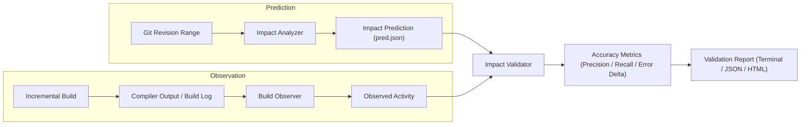

# CompileForge Prediction Validation Engine

CompileForge implements a closed-loop validation engine that compares **predicted change-impact blast radius** against **actually observed compiler activity**.

---

## 1. Validation Architecture

---

## 2. Accuracy Metrics Formulation

CompileForge evaluates predictions against observed builds using standard statistical metrics:

- **True Positives ($TP$)**: Translation units that were predicted to be affected and were actually compiled by the build system.
- **False Positives ($FP$)**: Translation units that were predicted to be affected but were *not* compiled (e.g. skipped by build caching tools or conditional includes).
- **False Negatives ($FN$)**: Translation units that were compiled by the build system but were *not* predicted by CompileForge.

### Precision
$$\text{Precision} = \frac{TP}{TP + FP} \times 100\%$$
*(Reported as `UNAVAILABLE` if no translation units were predicted.)*

### Recall
$$\text{Recall} = \frac{TP}{TP + FN} \times 100\%$$
*(Reported as `UNAVAILABLE` if no translation units were observed to rebuild.)*

### Rebuild Surface Error Delta
$$\text{Rebuild Surface Error Delta} = |\text{Predicted Rebuild Surface \%} - \text{Observed Rebuild Surface \%}|$$

### Build-Cost Error Delta
$$\text{Build-Cost Error Delta} = \frac{|\text{Predicted Seconds} - \text{Observed Seconds}|}{\text{Observed Seconds}} \times 100\%$$
*(Reported as `UNAVAILABLE` when historical `-ftime-trace` logs are not available.)*

---

## 3. Demonstration Scope & Context

> [!NOTE]
> In the included 3-TU demonstration fixture (`examples/impact_demo_app`), CompileForge achieved 100% precision and recall. This represents validation of a controlled demonstration scenario and is not an assertion of generalized statistical accuracy across arbitrary external codebases.
